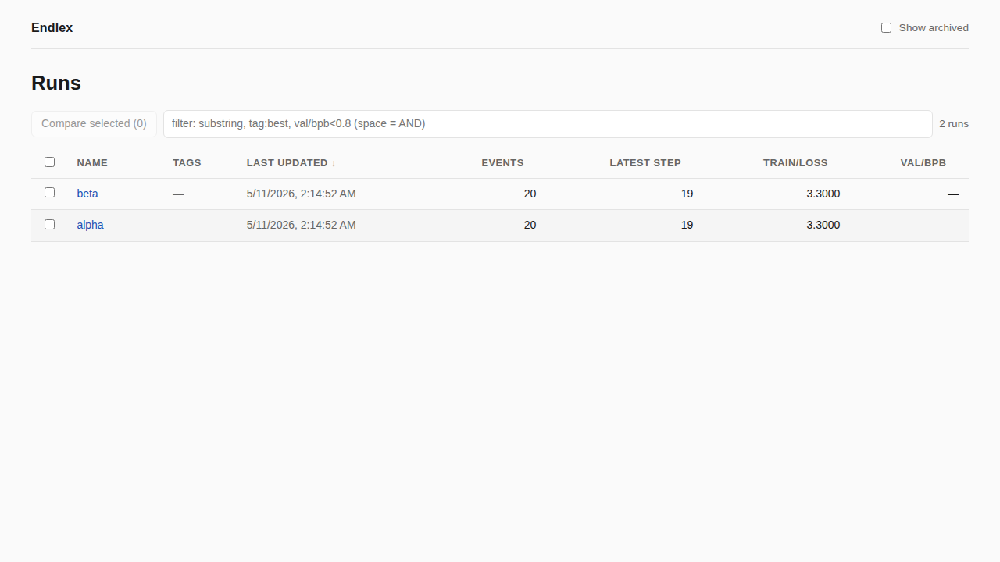
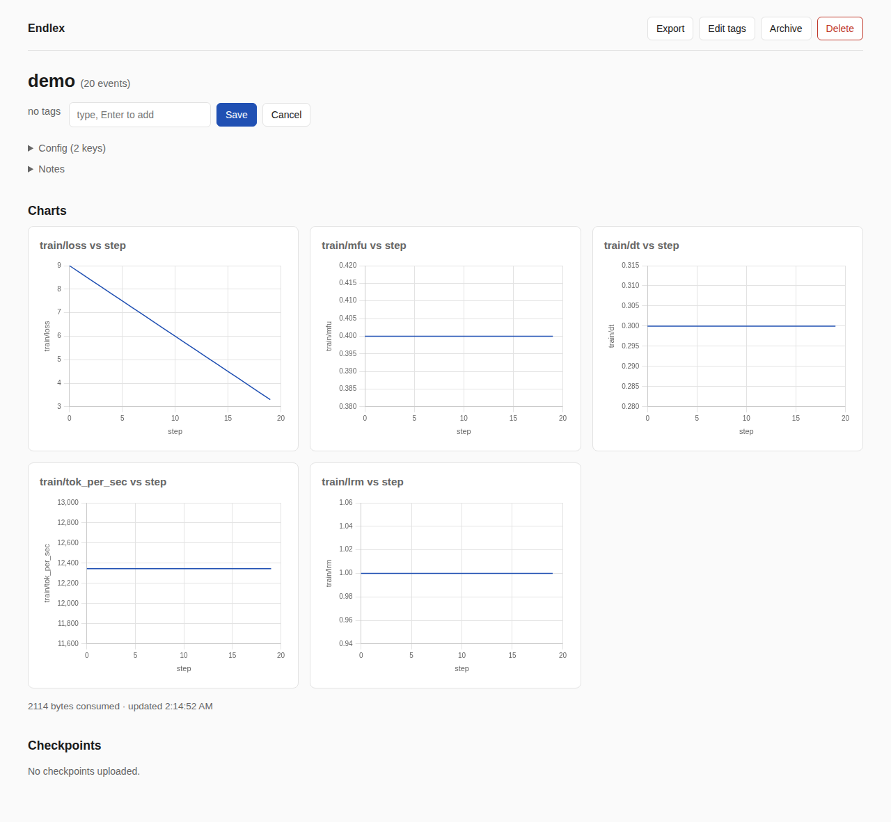
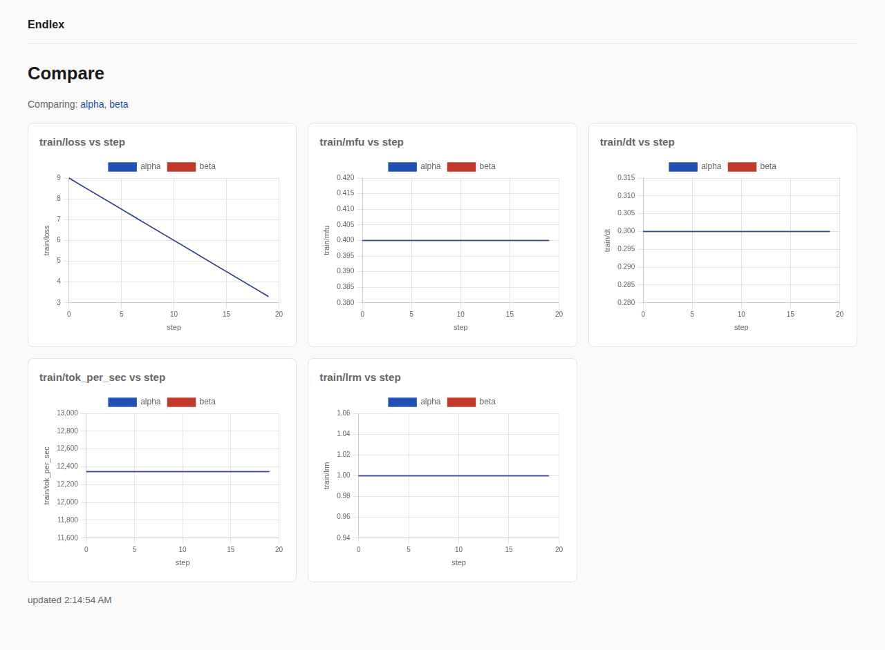
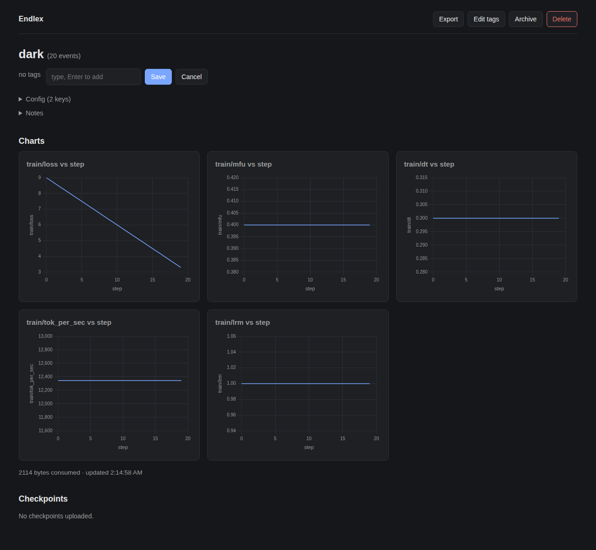

# Endlex

A self-hosted, single-user replacement for wandb's metrics tracking and model checkpoint sync. Built primarily as telemetry for solo LLM training: cloud GPU instances push metrics and final weights to a home server; evaluation, inference, and chat experiments happen locally.

Initially built as the observability layer for ArcherChat (a from-scratch nanochat rewrite), but usable for any single-user training workflow that doesn't need wandb's team, sweep, or artifact-quota machinery.



## Features

**Server**
- FastAPI app behind your existing nginx + Let's Encrypt; storage is plain files under `$ENDLEX_DATA/` (no DB) — `du -sh`, `rm -rf`, `tail -f` all work
- Bearer-token auth on writes (constant-time compare); reads configurable open or token-gated
- Dashboard with sortable runs table, filter grammar (substring / `tag:foo` / `key<op>num`), tags + archive + delete + free-form notes + per-run/global checkpoint retention
- Multi-run overlay at `/compare?runs=a,b,c` with color-coded legend; self-contained static HTML export at `/api/runs/<name>/export.html`
- Live updates via SSE (`/api/runs/<name>/metrics/stream`), with 5 s polling as fallback
- `/health` probe; `POST /api/admin/prune` for cron-driven retention sweep
- Cached run summaries (`.summary.json` sidecar) so `list_runs()` stays O(1) per run even with many runs × millions of events

**Client (`endlex.Tracker`)**
- wandb-shaped API: `init` / `log` / `finish` / `flush` — drop-in for `wandb.log()` call sites
- Hot-path `log()` median ~3 µs (budget: <100 µs, enforced by a perf gate that runs in CI)
- Local JSONL is the source of truth; daemon thread batches POSTs (defaults: 100 events / 5 s); drop-oldest under sustained backpressure
- Retry-with-backoff on 5xx + transport errors; warns on stderr at finish if remote diverged from local
- Resync local → remote on startup, so a cloud trainer that crashed mid-run picks up where it left off

**Checkpoint sync** (`upload_checkpoint_async`)
- Multipart streamed upload from `save_checkpoint`; runs in its own daemon thread
- Local save is the source of truth, remote is best-effort



## Quick start

### On the home box

```bash
git clone https://github.com/<you>/Endlex.git /srv/endlex
cd /srv/endlex
uv sync --extra server
export ENDLEX_TOKEN=$(python -c 'import secrets; print(secrets.token_urlsafe(32))')
export ENDLEX_DATA=/var/lib/endlex
uv run endlex-server   # binds 0.0.0.0:8000 by default
```

For production, drop in [`deploy/endlex.service`](deploy/endlex.service) (systemd) and [`deploy/nginx.conf.snippet`](deploy/nginx.conf.snippet) (reverse proxy with `proxy_request_buffering off` so multi-GB checkpoints stream through). See [`deploy/README.md`](deploy/README.md) for the full install path.

### On the cloud trainer

```bash
pip install endlex                                  # client deps only, no FastAPI
export ENDLEX_URL=https://example.com/endlex        # your home box
export ENDLEX_TOKEN=...                             # same token
```

In the trainer:

```python
from endlex import Tracker, upload_checkpoint_async

tracker = Tracker(project="archerchat", name=run_name, config=cfg)

for step in range(num_steps):
    train_step()
    tracker.log({"step": step, "train/loss": loss, "train/mfu": mfu})

    if step % 500 == 0:
        save_checkpoint(...)
        if rank == 0 and os.environ.get("ENDLEX_URL"):
            upload_checkpoint_async(
                run_name, step,
                {"model.pt": model_path, "meta.json": meta_path},
            )
        tracker.flush()  # optional: make sure dashboard catches up

tracker.finish()
```

That's it. No team/sweep ceremony, no quotas, no daemon to install.

## Multi-run comparison

`/compare?runs=foo,bar` overlays selected runs on the standard chart panels. Pick runs from the dashboard checkboxes:



## Dark mode

Auto-detected via `prefers-color-scheme`:



## Design rationale

See [TECH_PLAN.md](TECH_PLAN.md) for the architecture, storage layout, HTTP API, client contract, performance rules, and roadmap (with v1 + most of v2/v3 checked off).

## License

TBD.
